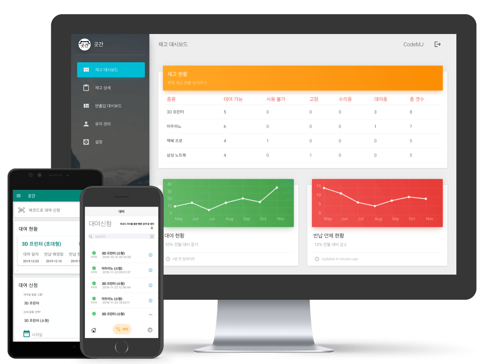

<h1 align="center">
  
   
  
GotGan

</h1>

    
    
    
    

GotGan, Modern stock management system

## Documents

[Requirement Analysis](https://github.com/LIMECAKE/GotGan/raw/master/요구사항분석서.pptx)  
[High-level Requirements](https://github.com/LIMECAKE/GotGan/raw/master/상위설계서.pptx)  
[Low-level Requirements](https://github.com/LIMECAKE/GotGan/raw/master/상세설계서.pptx)  

## Platforms

Web (Vue.js)  
Android (SDK)  
iOS (Swift) 

## Design Flows

</img>
</img>

</img>
</img>

## Screenshots - Web

</img>
</img>

</img>
</img>

## Screenshots - Mobile

</img>
</img>

## Participant
Server by [LimeCake](https://github.com/LIMECAKE)  
Web by [Moon Juhan](https://github.com/MoonJuhan)  
iOS by [7kQon](https://github.com/7kQon)  
Android by [OChangHan](https://github.com/OChangHan)  

## License
Korea Copyright registration number C-2019-041017  
[Apache](LICENSE) © 2020 Team GotGan <limecake23@gmail.com>